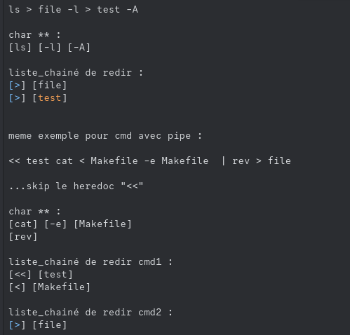
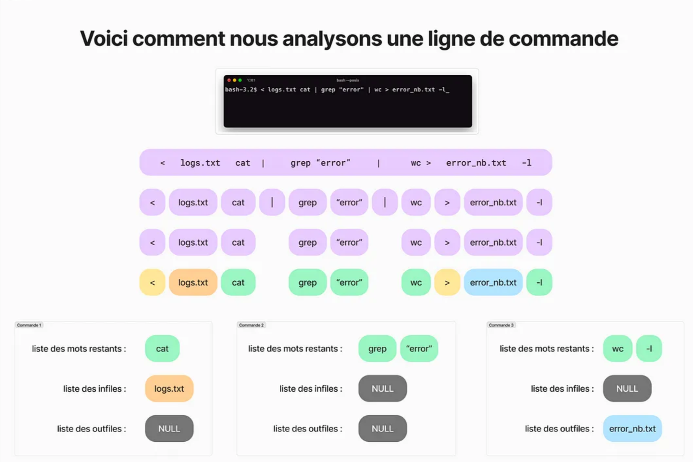

# Minishell

*This project is about creating a simple shell.
Yes, your own little bash.
You will learn a lot about processes and file descriptors.*

---

# Table des Matières

- [Minishell](#minishell)
- [Table des Matières](#table-des-matières)
  - [Ressources pour travailler en groupe avec Git](#ressources-pour-travailler-en-groupe-avec-git)
    - [Git ressources](#git-ressources)
    - [Ligne directrice de nos commits/push/reviews](#ligne-directrice-de-nos-commitspushreviews)
  - [Qu'est-ce que Minishell ?](#quest-ce-que-minishell-)
  - [Fonctions autorisées](#fonctions-autorisées)
    - [`readline()`](#readline)
    - [`rl_clear_history()`](#rl_clear_history)
    - [`rl_on_new_line()`](#rl_on_new_line)
    - [`add_history()`](#add_history)
    - [`getcwd()`](#getcwd)
    - [`unlink()`](#unlink)
    - [`isatty()`](#isatty)
  - [Quelques rendus avec erreurs :](#quelques-rendus-avec-erreurs-)
      - [Résumé des erreurs trouvées :](#résumé-des-erreurs-trouvées-)
    - [Random](#random)
    - [Valgrind and `readline()` leaks](#valgrind-and-readline-leaks)
    - [Random attributs et optimisations](#random-attributs-et-optimisations)
    - [Autres ressources](#autres-ressources)
    - [Garbage Collector](#garbage-collector)
  - [Terminal modes](#terminal-modes)
    - [Mode interactif](#mode-interactif)
    - [Mode non interactif](#mode-non-interactif)
    - [Pourquoi faire des distinctions entre les modes](#pourquoi-faire-des-distinctions-entre-les-modes)
  - [Décomposition des concepts à la réalisation de Minishell](#décomposition-des-concepts-à-la-réalisation-de-minishell)
    - [Analyse lexicale (Lexing) : Découper l'input utilisateur en tokens](#analyse-lexicale-lexing--découper-linput-utilisateur-en-tokens)
    - [Analyse syntaxique (Parsing) : Organiser les tokens](#analyse-syntaxique-parsing--organiser-les-tokens)
    - [Interprétation et exécution](#interprétation-et-exécution)
    - [Expansions et gestion des variables](#expansions-et-gestion-des-variables)
    - [Arbre binaire premiere recherches](#arbre-binaire-premiere-recherches)

## Ressources pour travailler en groupe avec Git

### Git ressources
- [Commit nomenclature](https://buzut.net/cours/versioning-avec-git/bien-nommer-ses-commits) *pas une norme mais une bonne pratique*
- [Git branching/merge commandes basiques avec schémas (doc en francais)](https://git-scm.com/book/fr/v2/Les-branches-avec-Git-Branches-et-fusions%C2%A0:-les-bases)
	- [Plus de documentation](https://www.varonis.com/blog/git-branching)
	- [Spécifique au merge](https://www.atlassian.com/git/tutorials/using-branches/git-merge)
	- [Liste de commandes utiles pour les déplacements entre branches](https://www.nobledesktop.com/learn/git/git-branches)
	- [Encore de la doc](https://gist.github.com/Alinaprotsyuk/3d58f8cd52eb03a11283d64beb0e083e) *pas vraiment utile étant donné qu'on a quasi décidé de notre façon de travailler*
- [GitHub pull review (documentation imagée des options disponibles lors des reviews)](https://docs.github.com/fr/pull-requests/collaborating-with-pull-requests/reviewing-changes-in-pull-requests/reviewing-proposed-changes-in-a-pull-request)

---

### Ligne directrice de nos commits/push/reviews

Dans l'ensemble, j'aimerais qu'on suive cette ligne directrice :
- Travailler dans des branches différentes (pour l'instant personnelles)
- Merge ensemble via les pull requests/reviews (au maximum pour les implémentations lourdes)
  - Dans la limite du raisonnable, on n'a pas besoin de request pour des changements mineurs (norme, etc.).
  - ***Toujours prévenir l'autre de pull lorsqu'on a push des modifications dans son coin sans recourir aux requests***
- Ne pas hésiter à mettre des commentaires partout
- Suivre une nomenclature claire pour les commits, au moins préciser le **type** de commit. Pour le sujet et le corps du message, ne pas hésiter à détailler un minimum les fonctionnalités ou changements ajoutés.
- ***whatelse??***

---

## Qu'est-ce que Minishell ?
- [Vidéo YouTube : Introduction à Minishell](https://www.youtube.com/watch?v=yTR00r8vBH8)
- [Documentation sur la création d'un shell](https://www.cs.purdue.edu/homes/grr/SystemsProgrammingBook/Book/Chapter5-WritingYourOwnShell.pdf)
- [Architecture de Minishell](https://whimsical.com/minishell-architecture-big-picture-7b9N8PL3qHrddbs977mQ2J)

---

## Fonctions autorisées

- **Pour toutes les fonctions de GNU Readline, tout est expliqué dans la doc du MIT** : [Programming with GNU Readline](https://web.mit.edu/gnu/doc/html/rlman_2.html)
### `readline()`
- Fais parti de la bibliothèque `GNU Readline`, permet de gérer l'entrée utilisateur avec des fonctionnalité avancées comme l'édition de ligne et l'historique.
- `readline()` récupère une ligne de texte.
- prototype : `char *readline(const char prompt);`
  - **prompt** est la chaine affichée avant l'entrée utilisateur (**pour notre minishell pourquoi pas le pwd actuel (ou uniquement le dossier courant + le nom de la branche git actuelle ?**)) *ALORS: mettre de la couleur cest un enfer + ca nous causera des soucis, peut etre commencer avec quelque chose de simple et a la fin si on veut pimper notre prompt on le ferra (cest du detail)*
  - Elle retourne un pointeur **vers la ligne lue (entrée par l'utilisateur)**, alloué dynamiquement
  - Si l'utilisateur envoie `Ctrl+D`, `readline()` retourne `NULL` (EOF). `Ctrl+D = SIG???` [Ctrl-D behavior detailed](https://stackoverflow.com/questions/1516122/how-to-capture-controld-signal)
  - Tout input dans `readline()` doit etre libéré avec `free()`
  - **Fonctionnalités avancées de `readline()`**
    - Edition de ligne : flèches directionnelles pour se balader et modifier l'entrée.

###  `rl_clear_history()`
- Supprime toutes les commandes enregistrées dans l'historique de `readline()`
- prototype : `void rl_clear_history(void);`
- Supprime toutes les commandes enregistrées avec ``add_history()``
- **add_history** ajoute une commande a l'historique
- **rl_clear_history** efface toutes les commandes de l'historique

### `rl_on_new_line()`
- Utilité : Informe `readline()` que le curseur est désormais sur une nouvelle ligne
- prototype : `int rl_on_new_line(void);`
- Comportement :
  - Utile lorsque minishell affiche des messages ou des sorties pendant que l'utilisateur est en train de saisir une commande. Permet d'eviter que la ligne en cours d'édition ne soit mélangée avec la sortie du programme.
### `add_history()`
- [manpage](https://linux.die.net/man/3/history)
- prototype : `void add_history(const char *string)`
- Place la `string` en parametre a la fin de l'historique
- Comportement :
  - Chaque fois qu'une commande est saisie, l'appel a `add_history` permet de la stockée. Penser a vérifié que l'input ne soit pas NULL, certaines versions de bash ne stockent pas un input NULL.
- Utilité : Permettre a l'utilisateur de ce balader dans l'historique de ces commandes avec les fleches haut/bas.

### `getcwd()`
- [manpage](https://linux.die.net/man/3/getcwd)
- prototype : `char *getcwd(char *buf, size_t size)`
- Recupere le chemin absolu du répertoire courant
- Utilité :
  - Sauvegarder dans un buffer (check `PATH_MAX`) le chemin du repertoire courant
  - Possibilité de passer `getcwd(NULL, 0)`, qui alloue dynamiquement le buffer

### `unlink()`
- [manpage](https://linux.die.net/man/2/unlink)
- prototype : `int unlink(const char *pathname)`
- Concretement, permet de supprimer un fichier comme rm le ferrai.
- Utilité dans minishell :
  - Potentiellement stocker l'historique dans un fichier externe, permettant de retrouver cet historique entre différentes instances de minishell
  - Stocker dans des fichiers temporaires les inputs utilisateurs lors de commandes utilisant des heredoc, ces fichiers seraient detruit apres le traitement des commandes

### `isatty()`
- [manpage](https://linux.die.net/man/3/isatty)
- prototype : `int isatty(int fd)`
- Check si `fd` fait référence a un terminal (tty)
- Utile pour déterminer si un programme s'exécute en [mode interactif](#terminal-modes)
---

## Quelques rendus avec erreurs :
- [Rendu de Minishell avec erreurs (Push invalidés)](https://projects.intra.42.fr/1331/aascedu)
- [Autre rendu avec erreurs](https://projects.intra.42.fr/projects/42cursus-minishell/projects_users/3658701)
- [Encore un autre rendu](https://projects.intra.42.fr/projects/42cursus-minishell/projects_users/3676106)

#### Résumé des erreurs trouvées :

- leaks/segfault en jouant avec les export/expands
- leaks/segfault quand on quitte sans executer de commandes
- heredocS
- commandes inconnues
- cd dans un dossier dont le parent à été supprimé
- executer une commande si le PATH à été supprimé mais que le binaire est dans le dossier courant
- "echo |" ??
- env | env | env ...
- "heredoc seul sans commande" ?
- `faire en sorte que ">export a='-l -a'" puis "ls $a" == 'ls -l -a'`
- `env -i ... == export $OLD_PWD=''` *pas du tout sur de moi*
- `./minishell | ./minishell` -> `isatty` *same shit je note sans savoir vraiment le comportement pour linstant*
- `< Makefile cat -e` *exemple de test*
- `grep "something" < infile > outfile` *encore un test*
- `>>>` `>>>>` `>>>><` `|` `|ls` `<|` *et encore*
- **Redirection !!** `echo bonjour > a > b > c` *en bash **bonjour** ne sera ecrit **QUE** dans **c**. Si un des fichiers dans la chaine de redirection n'existe pas il sera créé. De plus, si l'un des fichiers de la chaine ne possede pas les droits, rien ne ce passe.*
- idée pour les heredoc :  `O_TEMP` option d'`open()`
- `fork cree une copie des variables du programme parent. Donc il faut bien penser a free les variables qui ont ete malloc avant de fork a la fois dans le parent et dans les enfants.`

---

### Random

Décomposition **"./program_name"**
- Dans un chemin (`PATH`), le `/` sépare les répertoires et fichiers dans un système (UNIX/Linux)
- Le point `.` représente le `répertoire actuel`
- `./program_name` indique explicitement ou ce trouve le programme
- `../program_name` ira chercher dans le dossier `parent` au `répertoire actuel`
- **Chemins absolus et chemins relatifs**
  - Chemin absolu:
    - commence toujours par `/` (racine du fichier)
    - exemple : `/bin/ls`
  - Chemin relatif:
    - Ne commence pas par `/`
    - Dépend du `répertoire actuel`
- `.` et `..` permettent d'executer un programme qui n'est pas dans le `PATH`

**Pourquoi `.` n'est pas dans `PATH` par défaut**
- N'importe quel fichier exécutable dans le répertoire courant pourrait etre exécuté sans précaution.

---
### Valgrind and `readline()` leaks

Options a utiliser avec valgrind pour masquer les leaks de `readline()` : **make valgrind**

`valgrind --supressions=.valgrind_suppress.txt --leak-check=full --trace-children=yes --track-fds=yes -- show-leak-kinds=all`

---

### Random attributs et optimisations

`__attribute__((noreturn))`
- Contexte: Utile pour les fonctions qui une fois appelées, ne reviennent jamais (`exit`).
- **Optimisation** -> le compilateur peut éliminer du code mort qui suivrait un appel a cette fonction.
- **Sécurité** -> Prévenir certains avertissements liés aux chemins de code non atteints.

`__attribute__((always_inline))`
- Contexte: Utile pour les fonctions courtes et souvent appelées (`ft_isspace()` etc pour le parsing)
- Le compilateur insère le code directement à l'endroit ou la fonction est appelée.
- **Performance** -> réduit le surcout d'appel de fonction.

`__attribute__((nonnull (indices)))`
- Contexte: Utile pour indiquer que certains arguments d'une fonctions ne doivent pas etre `NULL`
- Pas sur que ca reproduise le comportement d'un shell je pense pas que ca nous soit utile.

### Autres ressources
### Garbage Collector
Pas sûr si c'est nécessaire pour le projet, mais voici quelques ressources :
- [Écrire un simple Garbage Collector en C](https://maplant.com/2020-04-25-Writing-a-Simple-Garbage-Collector-in-C.html)
- [BDWGC : Garbage Collector pour C](https://github.com/ivmai/bdwgc)

---

## Terminal modes

### Mode interactif
- Définition: Un programme s'exécute en mode interactif lorsqu'il communique directement avec l'utilisateur via un terminal.
  - **Un prompt est affiché** : invite l'utilisateur a saisir des commandes
  - **Les entrées et sorties** sont directement reliées a un terminal (tty)
  - **Les signaux** sont gérés de maniere a permettre a l'utilisateur d'intéragir avec le prompt
- Identifier le mode interactif:
  - [isatty](#isatty) sur la `STDIN` (et la `STDOUT`),

### Mode non interactif
- Définition: Un programme s'exécute en mode non interactif lorsqu'il n'est pas directement lié à un terminal pour l'entrée et/ou la sortie. Dans ce mode:
  - **Pas de prompt interactif** : Le programme ne présente pas de prompt à l'utilisateur, car il lit ses commandes à partir d'un fichier, d'un pipe ou d'une redirection.
  - **Traitement en lot** : Lorsqu'un script shell est exécuté, Bash lit le contenu du fichier de commandes et l'exécute séquentiellement sans intervention manuelle.
  - **Différentes gestions de signaux** : `Ctrl+C` et les autres signaux n'ont pas le meme comportement.

### Pourquoi faire des distinctions entre les modes

- **Fonctionnalités interactives** : Dans le mode interactif, le shell peut activer des fonctionnalités avancées (édition en ligne, historique...) et gérer les interruptions de facon spécifique.
- **Adaptation du comportement** : Si le programme détecte qu'il est en mode non interactif, il peut désactiver l'affichage du prompt ou adopter un comportement différent pour éviter d'afficher des messages qui ne seraient pas utiles.
- **Gestion des erreurs et des signaux** : Comme spécifié dans le mode non interactif, les signaux peuvent avoir des comportements différents entre les modes.
---

## Décomposition des concepts à la réalisation de Minishell

### Analyse lexicale (Lexing) : Découper l'input utilisateur en tokens

L'input utilisateur, une chaine de charactere doit etre "décomposée" en morceaux significatifs : **tokens**

*Turning the input of characters into a stream of tokens*

**Objectifs de l'analyse lexicale (qu'on appelera Lexer)**
- **Identifier** et **extraire** les éléments syntaxiques (mots, opérateurs, séparateurs, variables d'environnements ?) qui constituent la commande.
- **Types de tokens**
  - Commandes: `ls`, `echo`, `cd` ... comprend les commandes **et** les built-in
  - Arguments: Les chaines qui suivent la commande et précisent les parametres (options pour les fonctions, `-la`, `"Directory..."`, etc)
  - Opérateurs spéciaux: Opérateurs logiques `||`, `&&` ; Redirections `>`, `<`, `>>`, `<<` ; pipes `|` ...
  - Espaces et séparateurs: Les espaces peuvent séparer des tokens mais peuvent aussi faire partie des chaines de charactères `" "`
  - Gestion des guillemets et échappements: Cas particuliers comme les chaines de charactères entre guillemets ou les charactères échappés `\` (par exemple) ne doivent pas couper un argument qui contient des esaces ou des charactères spéciaux.

### Analyse syntaxique (Parsing) : Organiser les tokens

Comprendre la relation des tokens entre eux.

**Objectif du Parser**
- Vérifier la syntaxe (s'assure que la commande est correctement formée) et créer une structure représentant la hiérarchie et les relations entre les tokens. *Référence aux **AST** [Arbre syntaxique abstrait](https://en.wikipedia.org/wiki/Abstract_syntax_tree)* (ou tout autre représentation similaire qui sépare par exemple la commande principale des redirections et des pipes).
- **Structure d'un AST dans Minishell**
  - **Noeud commande**: Représente la coomande principale et ses arguments
  - **Noeud opérateur**: Représente les relations (`pipe`) qui connecte la sortie d'une commande à l'entrée d'une autre, ou les redirections qui indiquent ou lire/écrire les données.
  - **Hiérarchie et priorité**: Le parser doit tenir compte des priorités.
  - **Exemple**: `cat file.txt | grep "motif" > output.txt` -> le pipe relie `cat` et `grep`, la redirection s'applique à la sortie de `grep`
- Validation de la syntaxe: Implique la vérification de la syntaxe (pas de redirections mal placé ou opérateurs isolés sans commandes associée)

### Interprétation et exécution

Une fois l'**AST** ou la structure des commandes construite, on passe a l'exécution

**Exécution des commandes**

Pour chaque commande dans l'AST, le shell doit :
- Localiser l'exécutable: Rechercher le chemin complet en utilisant la variable d'environnement `PATH` (et/ou chercher dans le repertoire courant le binaire)
- Créer des processus: `fork()` et `execve()`
- Gérer la communication entre processus: Si il y a `pipe`, connecter la `stdout` d'un procesus a la `stdin` du suivant
- Redirections: Modifier les descripteurs de fichiers pour rediriger les entrées/sorties vers/depuis des fichiers, en fonctions des opérateurs (`>`, `<`)

> J'ai deja pas mal détaillé le fonctionnement et les outils nécessaire a l'exec de commande dans mon [pipex](https://github.com/AzehLM/pipex/blob/master/README.md)

**Gestion des erreurs**
- Notre Minishell doit gérer des erreurs à différents niveaux: erreurs de syntaxe (lexing/parsing), erreurs d'exécution (permission, binaire introuvable, etc) et erreurs dans les redirections

### Expansions et gestion des variables

Minishell doit gérer la gestion des variables et des expansions.

**Variables d'environnement**
- Remplacer les tokens `$HOME`, `$PATH` ... par leur valeur correspondante dans l'environnement

**Expansions de commandes**
- On pourrait vouloir exécuter une commande et utiliser sa sortie dans une autre commande (exemple: `echo 'date'` ou `$(date)`), ce qui demande d'évaluer une sous-commande et d'insérer son résultat dans le flux des tokens

**Gestion des guillemets**
- Guillemets simples ou doubles peuvent modifier la facon dont les expansions et les séparations se font.
- **Exemple**: `"Hello $USER"`, `$USER` doit etre remplacé par sa valeur, alors que `'Hello $USER'` doit rester littéral

---

liens sur lesquels jetais en train de travailler avant de partir dimanche soir:

[minishell tuto ??](https://github.com/achrafelkhnissi/minishell)

[write your own shell](https://www.cs.purdue.edu/homes/grr/SystemsProgrammingBook/Book/Chapter5-WritingYourOwnShell.pdf)

[personal chatgpt history](https://chatgpt.com/c/6797e03d-6c84-8004-a112-5acbcc432f34)

[42gitbook](https://42-cursus.gitbook.io/guide/rank-03/minishell/functions)

[GNU redirection](https://www.gnu.org/software/bash/manual/bash.html#Redirections)

[GNU pipelines](https://www.gnu.org/software/bash/manual/bash.html#Pipelines)

[shell options (built-in ??)](https://www.quennec.fr/trucs-astuces/syst%C3%A8mes/gnulinux/programmation-shell-sous-gnulinux/param%C3%A9trer-son-environnement-de-travail/les-options-du-shell)

[Parsing #1](https://eli.thegreenplace.net/2012/08/02/parsing-expressions-by-precedence-climbing)

[Parsing #2 - Shunting-Yard algo 1](https://brilliant.org/wiki/shunting-yard-algorithm/)

[Parsing #2 - Shunting-Yard algo 2](https://fr.wikipedia.org/wiki/Algorithme_Shunting-yard)

[Parsing #2 - Shunting-Yard algo 3](https://www.reddit.com/r/ProgrammingLanguages/comments/llc2i3/modifying_the_shuntingyard_algorithm_for_logical/?tl=fr&rdt=38434)

[Parsing #3 - AST](https://github.com/fraqioui/minishell/blob/main/README.md)

[Aller à une section spécifique d'un autre Markdown](XXX.md#nom-de-la-section)

[Arbre binaire](https://app.studysmarter.de/studyset/22404155/summary/71921711)

[Youtube #1 video Shuting Yard](https://www.youtube.com/watch?v=Wz85Hiwi5MY)

[Youtube #2 video Shuting Yard](https://www.youtube.com/watch?v=unh6aK8WMwM)

[gdoc #1 de commandes a tester](https://docs.google.com/spreadsheets/d/1BPW7k81LJPhGv2fbi35NIIoOC_mGZXQQJDnV0SjulFs/edit?gid=0#gid=0)

[gdoc #2 de commandes a tester](https://docs.google.com/spreadsheets/d/1uJHQu0VPsjjBkR4hxOeCMEt3AOM1Hp_SmUzPFhAH-nA/edit?pli=1&gid=0#gid=0)

[man bash -> CTRL+F : variables du shell (2/7)](http://manpagesfr.free.fr/man/man1/bash.1.html)

[swapping two nodes of a chaines list](https://www.geeksforgeeks.org/swap-nodes-in-a-linked-list-without-swapping-data/)

### Arbre binaire premiere recherches

Un arbre binaire est une structure de données arborescente dans laquelle chaque noeud a le plus possible deux enfantsm appelés enfant de gauche et enfant de droite.

- **Principales propriétés d'un arbre binaire**
  - Racine: le noeud le plus haut de l'arbre
  - Enfant: Tout noeud, a l'exclusion de la racine, connecté vers le haut
  - Parent: Pout tout noeuf "enfant", le noeud connecté au-dessus de lui, plus proche de la racine
  - Feuille: Noeud sans enfant (au plus bas de l'arbre)
  - Sous-arbre: Tout noeud peut etre considéré comme la racine d'un sous-arbre
  - Visiter: Exécuter une certaine forme d'opérationm c'est a dire imprimer ou calculer une fonction au niveau d'un noeud
  - Traverser: Visiter les noeuds dans un certain ordre
  - Niveaux: Chaque niveau est numérotés de la racine vers le bas. Racine etant le niveau 1
  -
